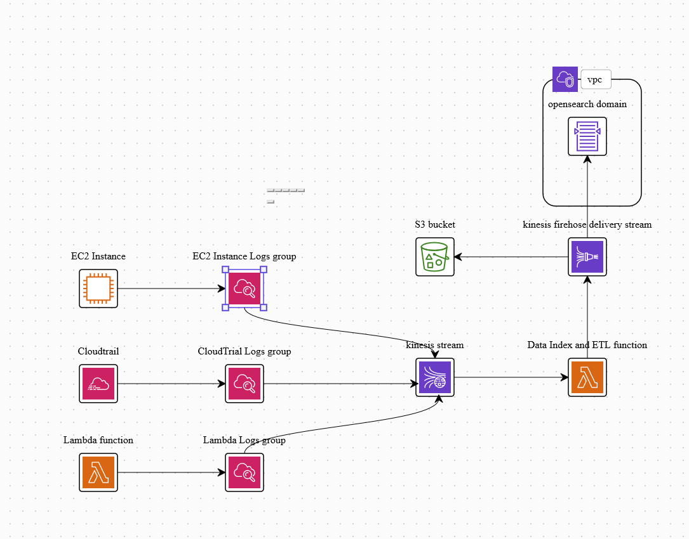

# CloudWatch Logs to OpenSearch Using Kinesis

This article/repo is all about instructions, steps, and usage of IaC (Infrastructure as a Code) on how to construct a unified logging solution inside AWS using CloudWatch, Kinesis, Kinesis Firehose, and OpenSearch. Despite the fact that there are numerous logging solutions available, this one is best suited for organizations that rely heavily on AWS for infrastructure. There is no need to rely on other provider or services, everything can be done within the AWS.



Logs could come from anywhere, CloudTrails, Ec2, S3, Billing, or Custom Applications, but in this one, I’m about to use custom logs from Ec2 Debian Based Instance as example.

## **Setup using AWS UI Wizard**

**Ec2 Logs to CloudWatch**

- Create **Ec2 Instance**
- Create the **IAM Role** with **CloudWatchAgentServerPolicy.**
- Attached the created **IAM Role** to Ec2 Instance
- Install **CloudWatch agent**

   

```bash
wget https://s3.amazonaws.com/amazoncloudwatch-agent/ubuntu/amd64/latest/amazon-cloudwatch-agent.deb
```

```bash
sudo dpkg -i -E ./amazon-cloudwatch-agent.deb
```

- Run the cloud watch agent wizard, (This will ask series of questions, and will configure CloudWatch agent by itself)

```bash
sudo /opt/aws/amazon-cloudwatch-agent/bin/amazon-cloudwatch-agent-config-wizard
```

- Start the agent

```bash
sudo /opt/aws/amazon-cloudwatch-agent/bin/amazon-cloudwatch-agent-ctl -a fetch-config -m ec2 -c file:/opt/aws/amazon-cloudwatch-agent/bin/config.json -s
```

- Now, log can be view in CloudWatch Logs Group by configure logs group name.

**CloudWatch to Amazon Kinesis**

- Create the **Kinesis Stream** in **Amazon Kinesis**
- Create the **IAM Policy** for to access Kinesis Stream from **CloudWatch** with following permission

```json
{
  "Version": "2012-10-17",
  "Statement": [{
    "Effect": "Allow",
    "Action": "kinesis:PutRecord",
    "Resource": "arn:aws:kinesis:<REGION>:<ACCOUNT_ID>:stream/<STREAM_NAME>"
  }]
}
```

- Create the **IAM Role** with **Custom trust policy** role type by using above policy; Sample JSON below

```json
{
  "Version": "2012-10-17",
  "Statement": {
    "Effect": "Allow",
    "Principal": {
      "Service": "logs.region.amazonaws.com"
    },
    "Action": "sts:AssumeRole",
    "Condition": {
      "StringLike": {
        "aws:SourceArn": "arn:aws:logs:<REGION>:<ACCOUNT_ID>:*"
      }
    }
  }
}
```

- Go to the **CloudWatch** and selecte the desire **Log Group**
- Select to **Action Subscription Filters.**
- To configure the Destination choose **Create Kinesis Subscription Filter**.
    - Select **Current Account**.
    - Select your Kinesis data stream from the dropdown list.
    - Select the IAM role that you previously created.
- Review the **Distribution method**:
    - **By Log Stream** - Verifies that downstream consumers can 
    aggregate log events by log stream, but might be less efficient. This 
    method might also incur higher streaming costs because it requires more 
    shards.
    - **Random** - Distributes the load across Kinesis stream shards, but downstream consumers can't aggregate log events by log stream.
- Configure log format and named the filter (Filter is the main point in streaimg to other services)
- Verify the pattern
- Click **Start Streaming**

**Kinesis to Kinesis Firehose and OpenSearch by using Lambda function and S3 as stored and ETL**

- Go to AWS **S3**
    - Create **bucket** for storing the **firehose logs backup**
- Go to **AWS Lambda**
    - Create function to process **Kinesis Logs** aka ETL Function**;** Sample code in javascript below

```jsx
console.log('Loading function');

exports.handler = async (event, context) => {
    /* Process the list of records and transform them */
    const output = event.records.map((record) => ({
        /* This transformation is the "identity" transformation, the data is left intact */
        recordId: record.recordId,
        result: 'Ok',
        data: record.data,
    }));
    console.log(`Processing completed.  Successful records ${output.length}.`);
    return { records: output };
};
```

      

- Go to **Amazon OpenSearch Service**
    - Click on **Domains** and then click on **Create Domain**
    - Give desire **domain name**
    - Enable **Custom endpoint** or not, (Disable for POC, too complicated for now)
    - Choose **Deployment Type**
    - Choose **Version** (Only ElasticSearch support dashboard right now)
    - Choose **Auto Tune**
    - Choose **Data Nodes**
    - In **Network** section, choose VPC access
        - Select **VPC**
        - Select **Subnets**
        - Select **Security Group (**Enable HTTP and HTTPS to access from Bastion Host or Inside Instances**)**
    - Choose **Fine-grained access control**
    - Create the **OpenSearch Domain**
- Go the **Amazon Kinesis Firehose**
- Click on **Create Delivery Stream**
    - Choose **Source** and **Destination (**Source: Amazon Kinesis Data Streams and Destination: Amazon OpenSearch Service for current setup**)**
    - Choose **Kinesis data stream**
    - Type **Delivery stream name**
    - Enable **Transform records**, choose created **Lambda Function**
    - Choose **OpenSearch Domain** and Configure
    - In **Backup Settings** choose created **S3**
    - Click on **Create delivery stream**
